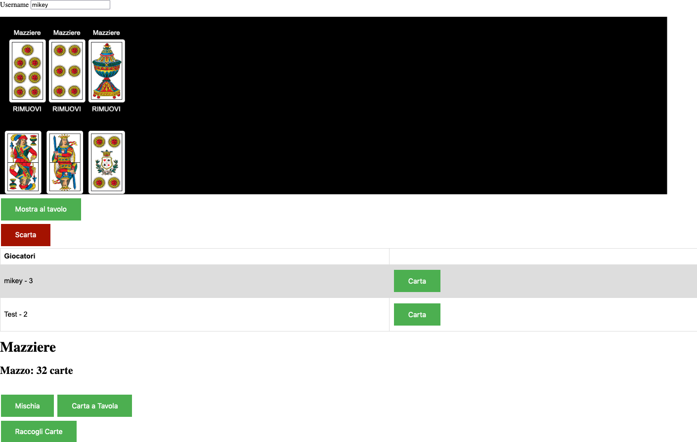
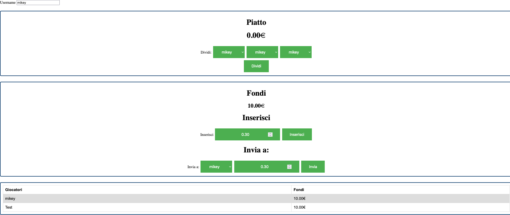

#Tavolo da Gioco di Carte Online
##Il Gioco

È possibile giocare su qualsiasi dispositivo che supporti un browser. Il mazziere lo può fare qualsiasi giocatore all'interno della partita, mentre le carte che sono state distribuite possono essere gestite solamente dai giocatori che ne sono in possesso. Le carte scartate sul tavolo vengono inserite nella parte alta del tavolo, da sinistra a destra, nell'ordine in cui vengono scartate. È possibile vedere il numero di carte degli altri giocatori accanto al nome dei giocatori.
##Fondi

È possibile giocare 'emulando' il gioco d'azzardo. Il piatto è il fondo comune dove vengono piazzate le puntate dei giocatori, al termine della partita è possibile dividere il piatto in 3 (facilitato per il gioco Bestia). Nel menù fondi è possibile inserire soldi nel piatto ed inviare soldi ad un altro giocatore.